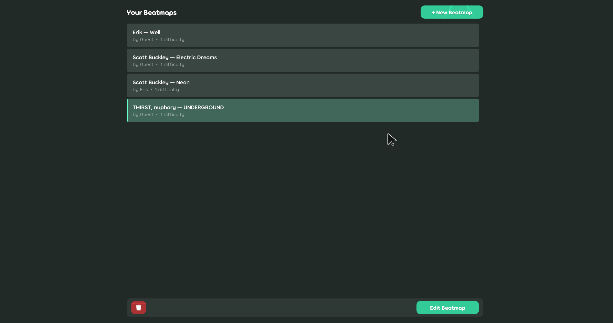
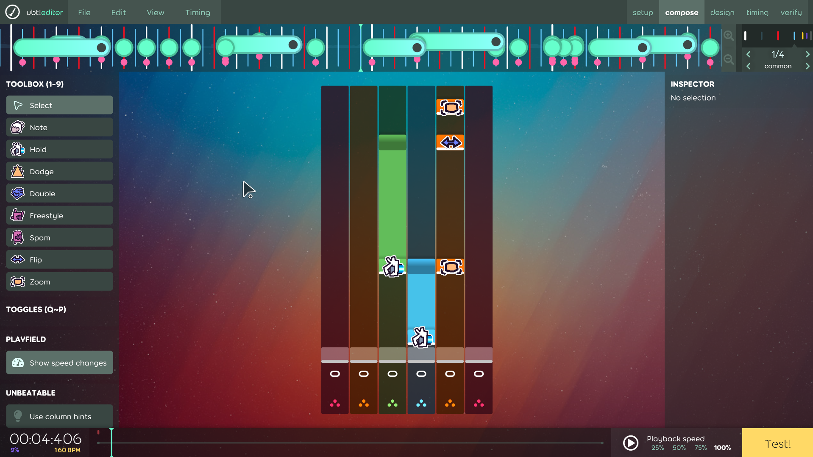
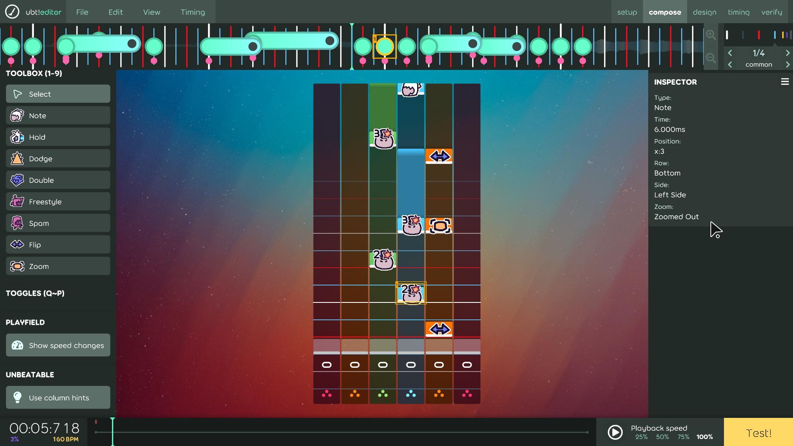
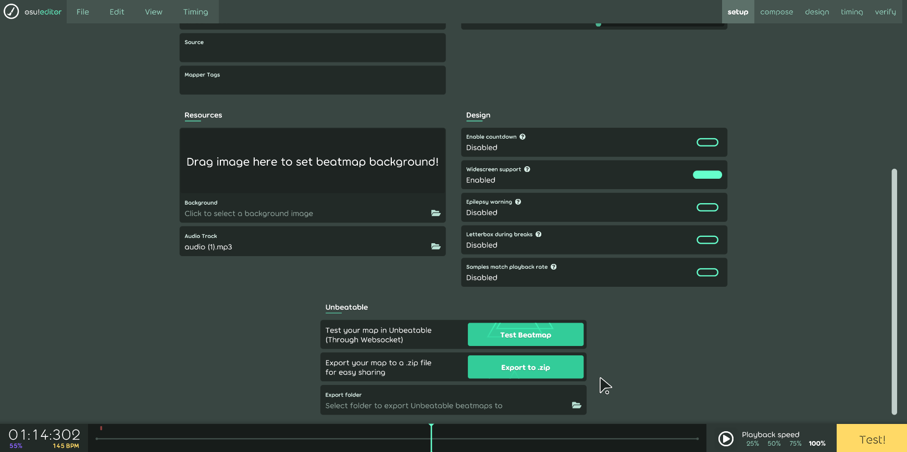

# Unbeatable Standalone Editor

A modified standalone osu!lazer editor that makes creating UNBEATABLE custom maps easier. Based on the osu!mania ruleset and editor.

[Installation](#installation) | [Features](#features) | [Getting started](#getting-started) | [Screenshots](#screenshots) | [License / Credits](#license--credits)

## Installation

> [!TIP]
> You can download the latest version of the editor from the [releases page](https://github.com/ErikGXDev/UnbeatableStandaloneEditor/releases).

The editor consists of an executable file along with some dlls. Extract the files to a folder of your choice and run the executable to start the editor.

> That's all there is to it!

Some data will be saved to an "unbeatable-beatmap-editor" folder. Find it in the following locations:

- `%AppData%\unbeatable-beatmap-editor` on Windows
- `~/.local/share/unbeatable-beatmap-editor` on Linux/macOS

## Features

- Simple note presets: Remembering and manually setting samples no longer required
- Note modifier menus: Easily customize notes
- In-editor note preview: See the type and modifiers of any note
- Column guides: Make sure you place notes where they belong
- Placement order: More control over how your notes spawn in-game
- Inspector: Easily check what side the notes are currently on.
- Simple export options: Export as your map as .zip or playtest directly in UNBEATABLE
- Cute icons
- Everything else the osu!mania editor has to offer (composition, timing, great ui)

> [!NOTE]
> Playtesting a map in UNBEATABLE through the Editor requires installing [this mod](https://github.com/ErikGXDev/UnbeatableWebsocket) for the game.

## Getting started

To start making your map, press the "New beatmap" button on the start screen. To edit an existing map, click on it in the list and press "Edit beatmap" at the bottom.

Inside the editor, you will find a piano roll with 6 columns. They are as follows:

| Column: |    1    |    2    |  3  |   4    |  5   |   6    |
|:-------:|:-------:|:-------:|:---:|:------:|:----:|:------:|
|  Type:  | Command | Command | Top | Bottom | Flip | Middle |

The most interesting ones will be Top, Bottom, Flip and Extra. They should be self-explanatory, but to avoid confusion, any selected note preset will highlight its corresponding columns in the editor and prevent you from placing them in the wrong column.

## Screenshots

_The beatmap selection screen. Create a new beatmap or edit an existing one._

_The standard interface of the editor. Use the tools on the left to select and place notes. Placed notes will show their respective icons and modifiers._

_Select a single note to see its properties. You can also check what side it will spawn on, and if the camera is zoomed out (centered)._

_Export your map as a .zip file using the buttons at the bottom of the setup page. Choose a folder, and click export. You can also quickly test the map in-game here._

# License / Credits

The UMania ruleset and UnbeatableStandaloneEditor code are licensed under the [MIT License](LICENSE)  and are available at the [GitHub repository](https://github.com/ErikGXDev/UnbeatableStandaloneEditor).

The osu.Game code and large parts of the UMania ruleset are derived from [osu!](https://github.com/ppy/osu), which is also licensed as MIT.

This project includes [osu-resources](https://github.com/ppy/osu-resources) created by [ppy](https://github.com/ppy), licensed under [CC-BY-NC 4.0](https://creativecommons.org/licenses/by-nc/4.0/). During the build process, the resource package may be modified to save disk space. The original resources can be found in the osu-resources repository.

Due to the nature of a lot of code being copied from osu!, the osu trademark and license may appear in the code. However, this project **is not affiliated with ppy or osu! in any way**.

This editor may be used to make custom maps for the game UNBEATABLE, but is not affiliated with D-CELL Games, Playstack or similar.

